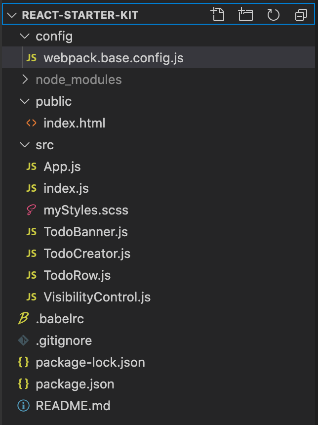

# Pro React 16

## CHAPTER 1

### Your First React Application

1. Preparing the Developpent Environment

2. Creating the Project
    1. Understanding the Project Structure

    

    2. Adding the Bootstrap CSS Framework
    3. Starting the Development

3. Replacing the Placeholder Content

4. Displaying Dynamic Content
    1. Understanding State Data Changes

5. Adding the To-Do Application Features
    1. Displaying the To-Do items

6. Introducing additional Components
    1. Using the child components

7. Adding the finishing touches
    1. Managing the visibility of completed tasks
    2. Persistently Storing Data
